# Week 0 — Billing and Architecture

---
#### Notes
    - Will be doing this entire bootcamp locally on my personal macbook
    - Redacted a portion of the AWS Account number for security reasons
  
### [Required HomeWork]
- [x] **Watched Week 0 - Live Streamed Video**
- [x] **Watched Chirag's Week 0 - Spend Considerations**
- [x] **Watched Ashish's Week 0 - Security Considerations**
- [x] **Recreate Conceptual Diagram in Lucid Charts or on a Napkin** 
  - Link to lucidcharts -> [Cruddur Conceptual Diagram](https://lucid.app/lucidchart/a38d49e1-290a-4010-bd28-4490168f48d8/edit?viewport_loc=-65%2C-11%2C2349%2C1200%2C0_0&invitationId=inv_9d0a9b8c-4862-44b1-8303-74ed28f37080)
  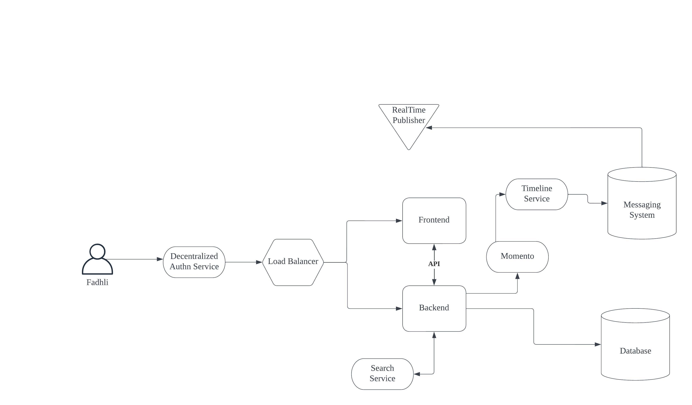
- [x] **Recreate Logical Architectual Diagram in Lucid Charts** 
  - Link to lucidcharts -> [Cruddur Logical Diagram](https://lucid.app/lucidchart/5f5596fb-37fd-4e2e-89ee-65b327d31c67/edit?viewport_loc=-401%2C-174%2C2760%2C1410%2C0_0&invitationId=inv_c37965af-1ad4-4bcc-a512-903f44dab489)
  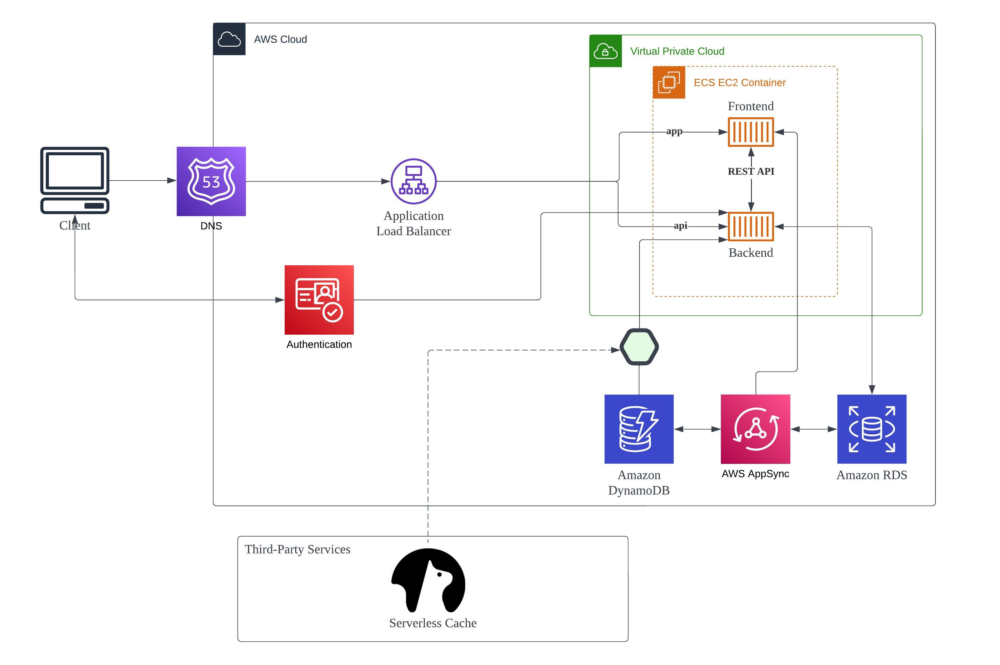
- [x] **Create an Admin User** 
  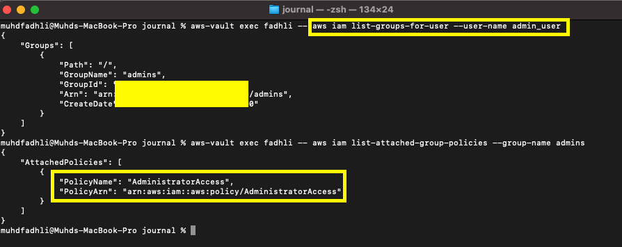
- [x] **Use CloudShell** 
  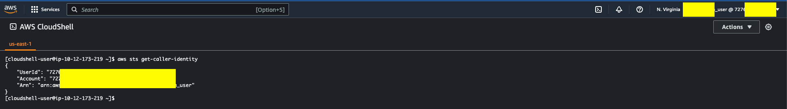
- [x] **Generate AWS Credentials** 
  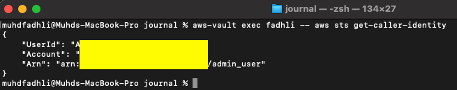
- [x] **Installed AWS CLI** 
  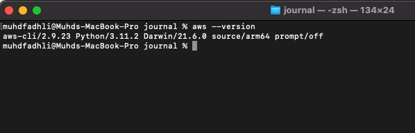
- [x] **Create a Billing Alarm** 
  - Followed the documentation here -> https://docs.aws.amazon.com/AmazonCloudWatch/latest/monitoring/monitor_estimated_charges_with_cloudwatch.html
  - Created 3 billing alarms
  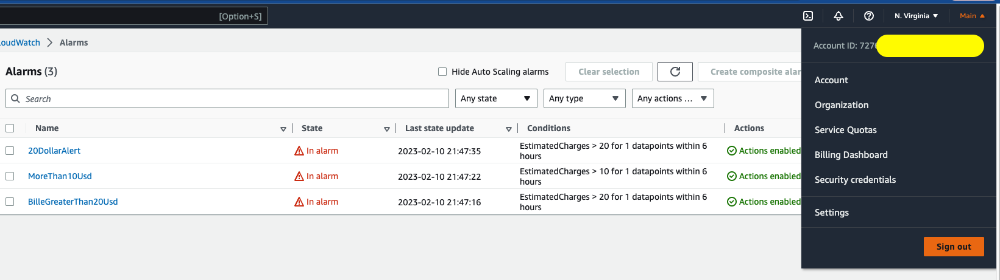
- [x] **Create a Budget** 
  - Created a monthly budget of $30. An amount that I've comfortably paid for over the past year for experiments.
  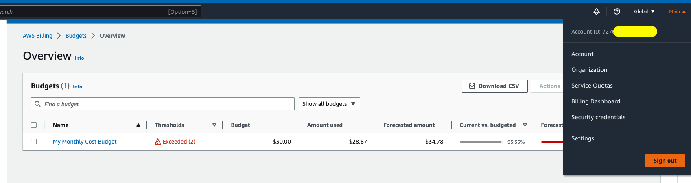
---
### Homework Challenges
- [x] **Destroy your root account credentials, Set MFA, IAM role** 
  - Destroyed Root Access Keys
  - Enabled MFA
  - Created a role for user to AssumeRole with 1hour session limitation and MFA configured.
 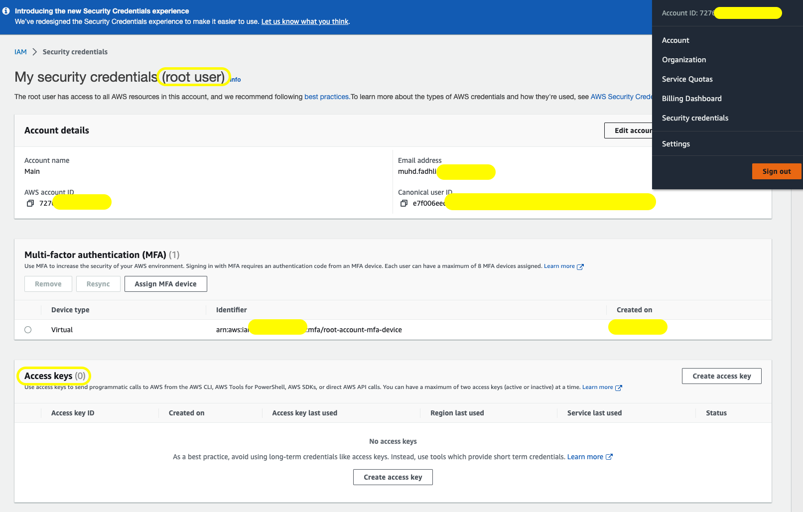
- [ ] **Use EventBridge to hookup Health Dashboard to SNS and send notification when there is a service health issue.** 
- [ ] **Review all the questions of each pillars in the Well Architected Tool (No specialized lens)** 
- [ ] **Create an architectural diagram (to the best of your ability) the CI/CD logical pipeline in Lucid Charts** 
- [ ] **Research the technical and service limits of specific services and how they could impact the technical path for technical flexibility.** 
- [x] **Open a support ticket and request a service limit** 
  - Followed the documentation here -> https://aws.amazon.com/getting-started/hands-on/request-service-quota-increase/
  - Requested for the AWS Cloudformation resource limit to be increased from 50 to 100.
  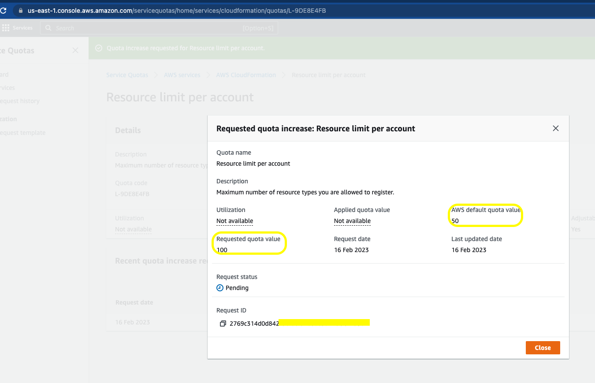
---
### Additional Self-Created Challenges
- [x] **Used aws-vault for programmatic access to better manage aws access keys locally by storing it in local keychain** 
  - Used an open-source solution to manage programmatic access locally. It stores the access keys in the local keychain. Security first! -> https://github.com/99designs/aws-vault
  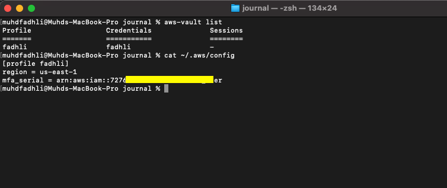
- [x] **Created addtional Service Control Policies as account guardrails** 
  - Implemented some of examples provided by AWS in the documentation here -> https://docs.aws.amazon.com/organizations/latest/userguide/orgs_manage_policies_scps_examples.html
  - Did this so as to prevent any unecessary resources being build in regions that I do not use.
  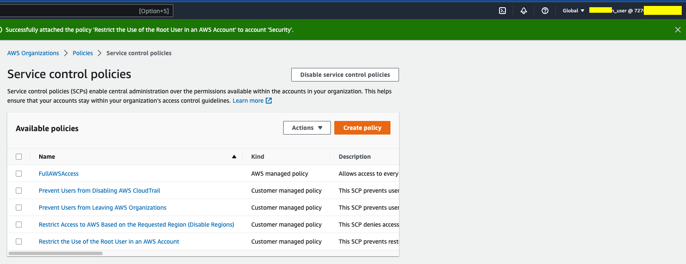
---